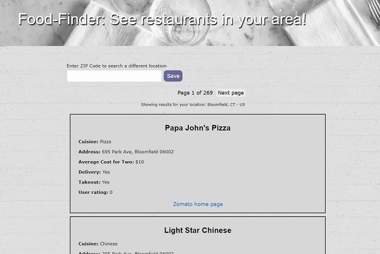
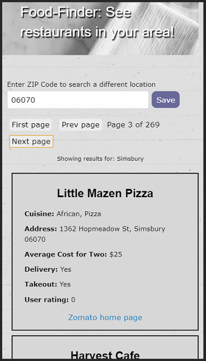

# food-finder-P1

Link: https://njohnerwin.github.io/food-finder-P1/#

# Developers:
 - Felix Colon https://github.com/bpr59
 - Nicholas Erwin https://github.com/njohnerwin
 - Carolene Wilson-Grizzle https://github.com/Carolenes
 - Matthew Craig https://github.com/mcraig150
 - Taewoo Kim

# User Story
 - AS A person looking for new food options in my area
 - I WANT an app that will provide nearby restaurants and delivery options
 - SO THAT I can see what's available and try out new cuisines

# Project Description
- Gets list of nearby restaurants
- Allows user to input distance radius
- Allow user to select to show all options or only delivery / pick-up
- Presents restaurants in list format
- Allow user to sort in order of popularity or price
-- Location (City + State + Street Address)
-- Name
-- URL (and menu URL)
-- Phone Number
-- Images
-- Price range
-- User rating

# APIs Used
 - Zomato API https://developers.zomato.com/documentation#!/restaurant/restaurant_0
 - Open Weather Map API https://home.openweathermap.org/
 - IP API https://ipapi.com/

# Programming Languages
- HTML5
    We used HTML to hold the basic structure of the website, no style or coding was performed in this file.
 - CSS
    The CSS file was used to managed the header image, fullpage background, font and background of each card that held the API response information.
 - JQuery
    Our JS file managed all the code and query to our API's, which included OpenWeather and Zomato. We used OpenWeather's location capability to 
    provide accurate zipcode information which we combined with Zomato to deliver a list of available restaurants in the user's area. We also added 
    the option to search other destinations via zipcode or city name. The query results provided the user name, location, contact information,
    average price and customer rating.

# Other Resources
- ZURB Foundation https://get.foundation/
    To manage the structure of the webpage and its responsiveness, we used Foundation as our CSS Framework template.

# Unfinished Goals
- 8 Coupons https://www.8coupons.com/deals/restaurants
    We wanted to provide the user the option to search for discounts to restaurants in their area via a link to 8coupons.com.

# Screen Shots

